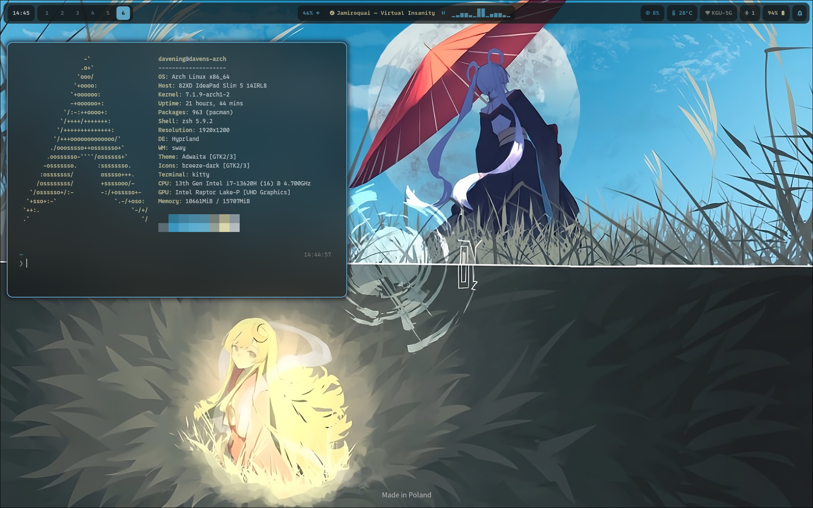
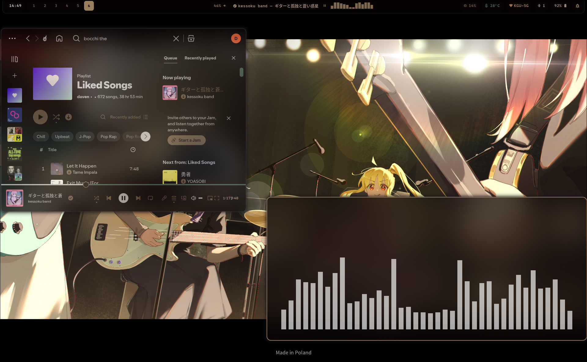

# Super Simple Hyprland Rice

My personal Arch Linux desktop configuration built around Hyprland, Pywal, Kitty,
Waybar, SwayNC, Rofi, Neovim, and a small collection of shell utilities.


## Highlights

- Wallpaper-driven colors through Pywal
- Liquid Glass like windows via Hyprglass
- Battery notifications with one-shot state handling
- English and Chinese input toggle with `Super+Space`
- Pywal themes for Discord,Bat,Spotify via Spicetify


## Showcase





## Installation 
Yay is needed for the complete Installation of my dotfiles, 
you can install it by following the instructions of [the yay repo](https://github.com/jguer/yay)
Otherwise run the install script with --no-packages

---

1. Clone this repo
```
git clone https://github.com/daveningfr/dotfiles.git
cd dotfiles
```

2. Run the install script
`./install.sh`
Make sure it is executable first
`chmod +x install.sh`

---

## Wallpaper usage

Change the wallpaper via using the wallpaper script created by yours truly
`wallpaper "path/to/your/wallpaper"`


## Layout

Configuration files mirror their paths under `$HOME`. The scripts in
`.local/bin` are executable utilities used by the Hyprland configuration.

## Requirements

Hyprland, Pywal, Kitty, Waybar, SwayNC, Rofi, Fcitx5, Bat, and 
the Wayland tools `grim` and `slurp`.

## Special Thanks

Thanks to [SaneAspect on youtube](https://www.youtube.com/@saneAspect) for giving tutorials on how to rice Hyprland.
Credits to [pywal-vencord](https://github.com/jhideki/pywal-spicetify) for creating the css file for vencord-discord
Shoutout to GPT-5.6 Luna for debugging my rice
